#  Urban Water Digital Twin — MLOps Project

> AI-powered predictive analytics, hydraulic simulation, and digital twin technology for intelligent urban water supply management across Bengaluru's 198+ wards.

###  Live Demo

https://kzamlg2zfzgu2eqh6jv6ss.streamlit.app

---

##  Overview

Urban Water Digital Twin is an end-to-end MLOps project that combines Machine Learning, Digital Twin Simulation, Hydraulic Modeling, and Water Redistribution Analytics to help city administrators monitor, predict, and optimize urban water distribution.

The platform enables real-time scenario analysis, demand forecasting, hydraulic pressure simulation, and automated redistribution planning for surplus and deficit wards.

---

##  Problem Statement

Managing water distribution across Bengaluru's 198+ wards is challenging due to:

* Uneven water supply and demand
* Seasonal fluctuations
* Lack of predictive planning
* Delayed response to shortages
* Absence of real-time decision support systems

Traditional systems react to shortages after they occur rather than predicting them beforehand.

---

##  Solution

This project creates an AI-powered Urban Water Digital Twin that:

* Predicts future supply-demand gaps using Machine Learning
* Simulates 24-hour water distribution behavior
* Models hydraulic network pressure using WNTR
* Identifies surplus and deficit wards automatically
* Generates optimal water redistribution plans
* Provides interactive analytics dashboards

---

##  Key Features

###  Ward Analytics Dashboard

* Ward-wise population and connection statistics
* Supply-demand ratio monitoring
* Monthly water distribution trends
* Seasonal imbalance analysis

###  What-If Simulation Engine

* Interactive supply and demand controls
* Real-time prediction of water shortages
* Before vs After comparison dashboards
* Dynamic Supply/Demand ratio analysis

###  SimPy Digital Twin

* 24-hour discrete-event simulation
* Critical, Warning, and Normal hour detection
* Hourly demand and supply forecasting
* Real-world uncertainty simulation

###  WNTR Hydraulic Simulation

* Water network pressure estimation
* Flow analysis
* Demand satisfaction metrics
* Physical shortage identification

###  Water Redistribution Engine

* Detects surplus and deficit wards
* Generates diversion plans automatically
* Calculates diversion coverage percentages
* Optimizes water allocation

---

##  Technology Stack

| Category         | Technologies                |
| ---------------- | --------------------------- |
| Programming      | Python                      |
| Machine Learning | Scikit-Learn, Random Forest |
| Data Processing  | Pandas, NumPy               |
| Simulation       | SimPy, WNTR                 |
| Explainability   | SHAP                        |
| Visualization    | Plotly                      |
| Dashboard        | Streamlit                   |
| Deployment       | Streamlit Community Cloud   |
| Version Control  | Git & GitHub                |

---

##  Dataset Information

### Dataset Size

* 4,800+ records
* 198+ Bengaluru wards

### Features

* Ward_Number
* Month
* Quarter
* Season
* Population
* Connections
* Connection_Density
* Consumption
* Supply
* Per_Capita_Consumption
* Supply_Per_Connection
* Supply_Demand_Ratio
* Imbalance_Score
* Demand_Gap

### Target Variable

**Demand_Gap (MLD)**

* Positive Value → Water Shortage
* Negative Value → Water Surplus

---

##  Machine Learning Pipeline

```text
Raw Data
   ↓
Feature Engineering
   ↓
Anomaly Detection
   ↓
Data Cleaning
   ↓
Random Forest Training
   ↓
Demand Gap Prediction
   ↓
Interactive Dashboard
```

### Model Used

RandomForestRegressor

### Prediction Features

```python
[
 'Ward_Number',
 'Month',
 'Quarter',
 'Population',
 'Connections',
 'Connection_Density',
 'Consumption',
 'Supply',
 'Per_Capita_Consumption',
 'Supply_Per_Connection',
 'Supply_Demand_Ratio'
]
```

---

##  Project Structure

```text
urban-water-digital-twin/
│
├── app.py
├── digital_twin_final.ipynb
├── water_dataset_ml_ready.csv
├── requirements.txt
├── README.md
│
└── dashboard-images/
    ├── 01-dashboard-home.jpeg
    ├── 02-before-after-comparison.jpeg
    ├── 03-supply-demand-ratio-analysis.jpeg
    ├── 04-what-if-simulation.jpeg
    ├── 05-water-redistribution-engine.jpeg
    ├── 06-simpy-simulation-log.jpeg
    ├── 07-simpy-digital-twin.jpeg
    ├── 08-simpy-24hour-simulation-log.jpeg
    ├── 09-wntr-hydraulic-simulation.jpeg
    ├── 10-surplus-to-deficit-diversion.jpeg
    └── 11-diversion-coverage-analysis.jpeg
```

---

##  Dashboard Screenshots

### Dashboard Home

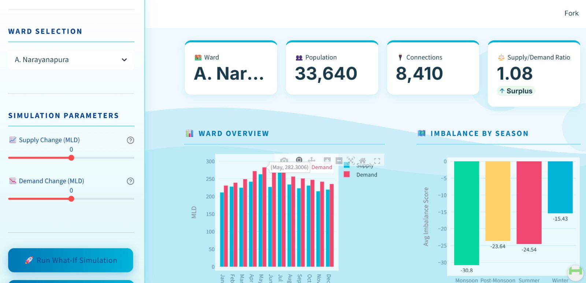

### Before vs After Comparison

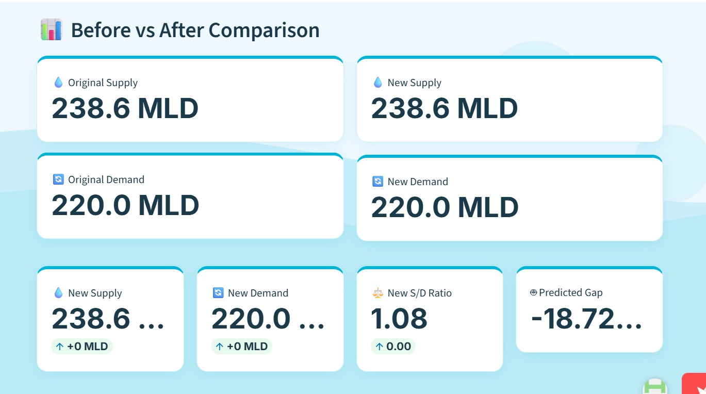

### Supply Demand Ratio Analysis

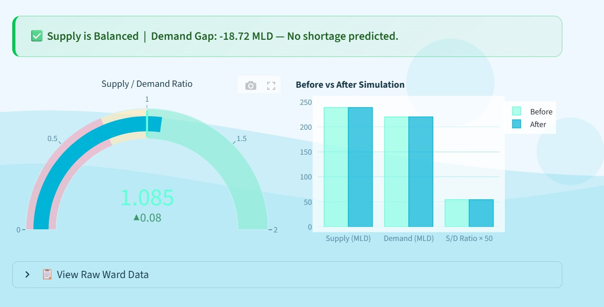

### What-If Simulation

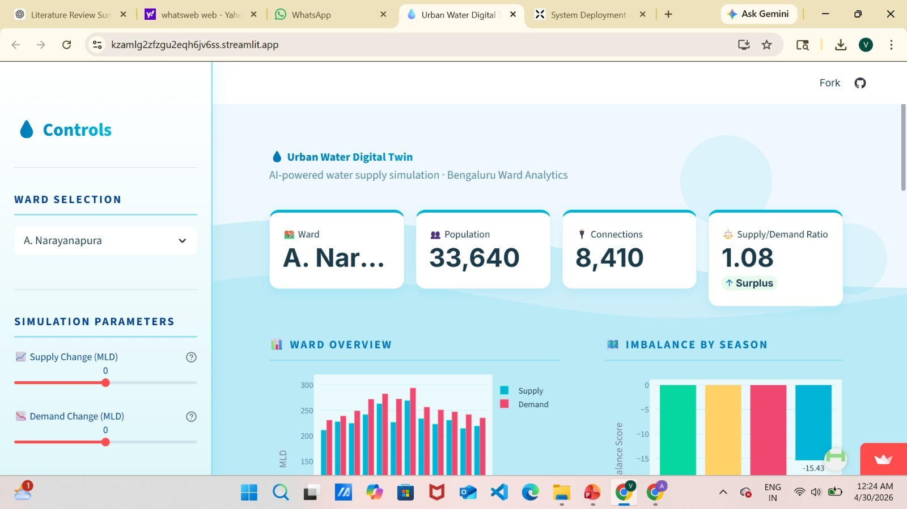

### Water Redistribution Engine

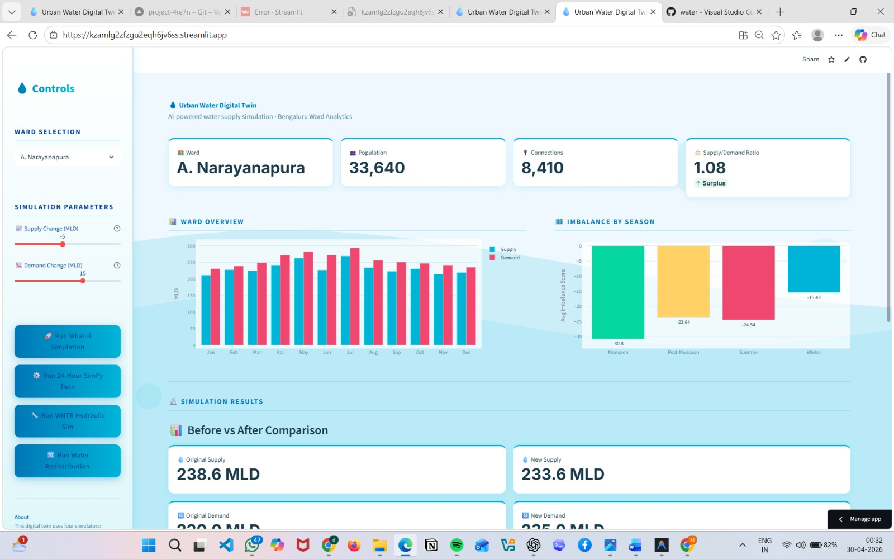

### SimPy Simulation Log

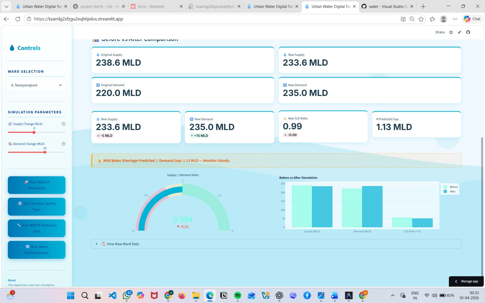

### SimPy Digital Twin

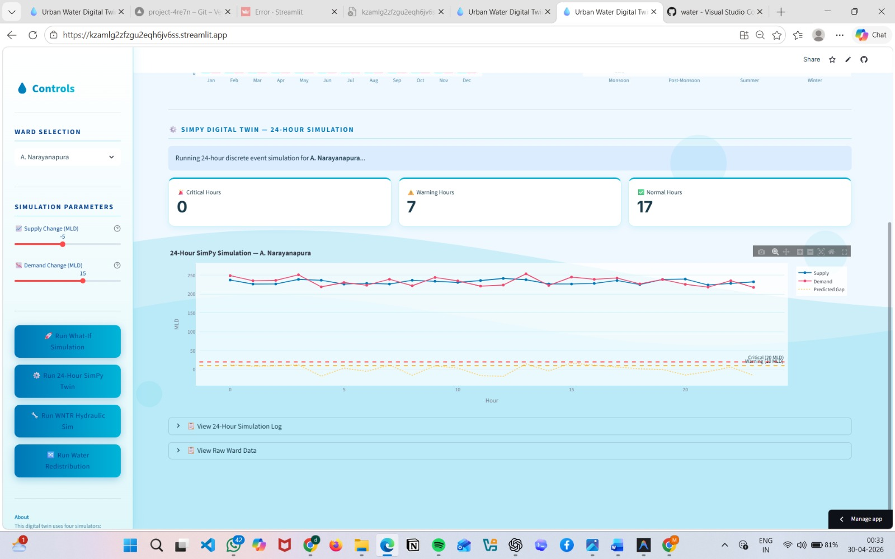

### 24-Hour Simulation Log

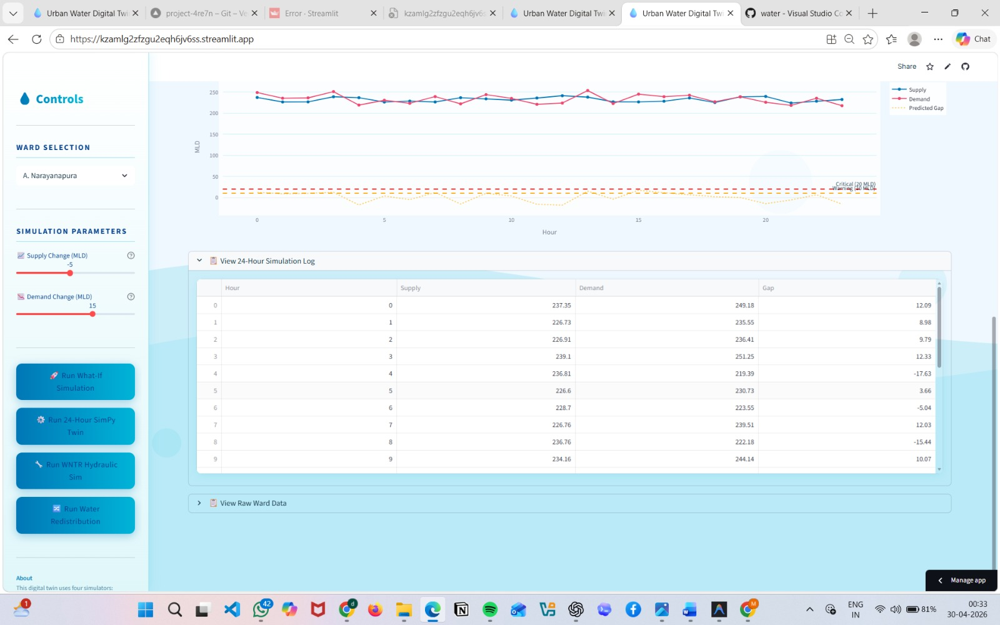

### WNTR Hydraulic Simulation

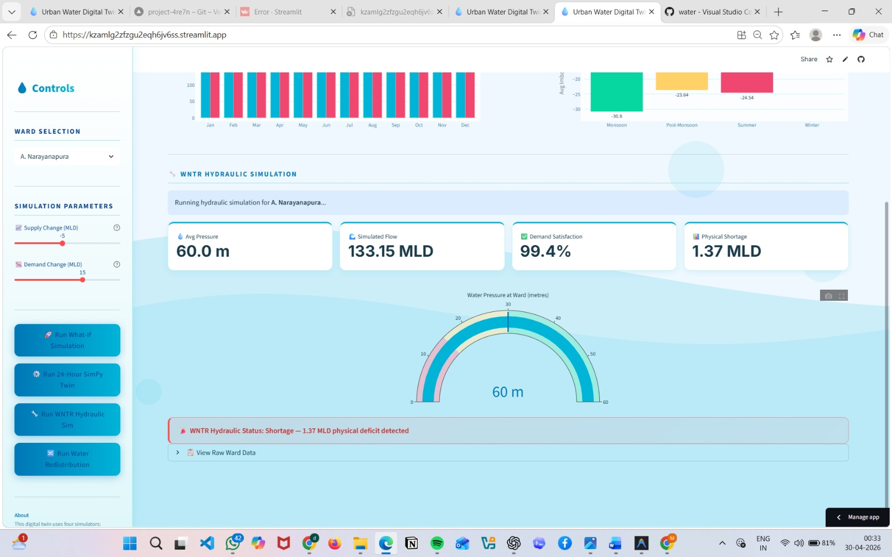

### Surplus to Deficit Diversion

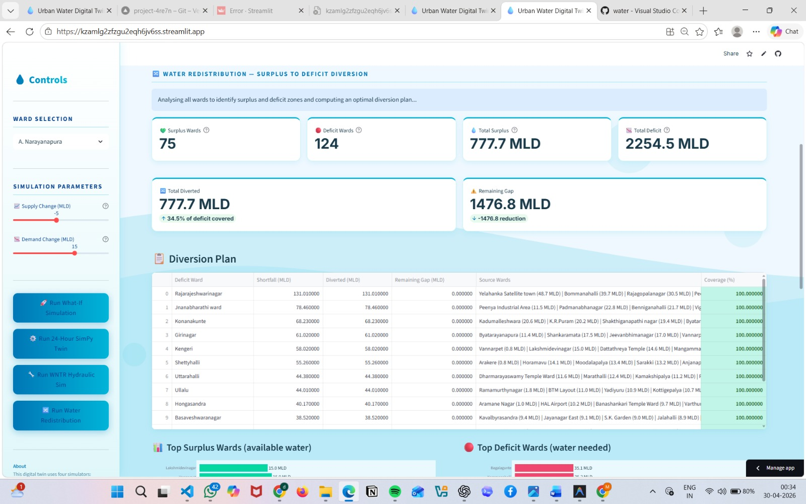

### Diversion Coverage Analysis

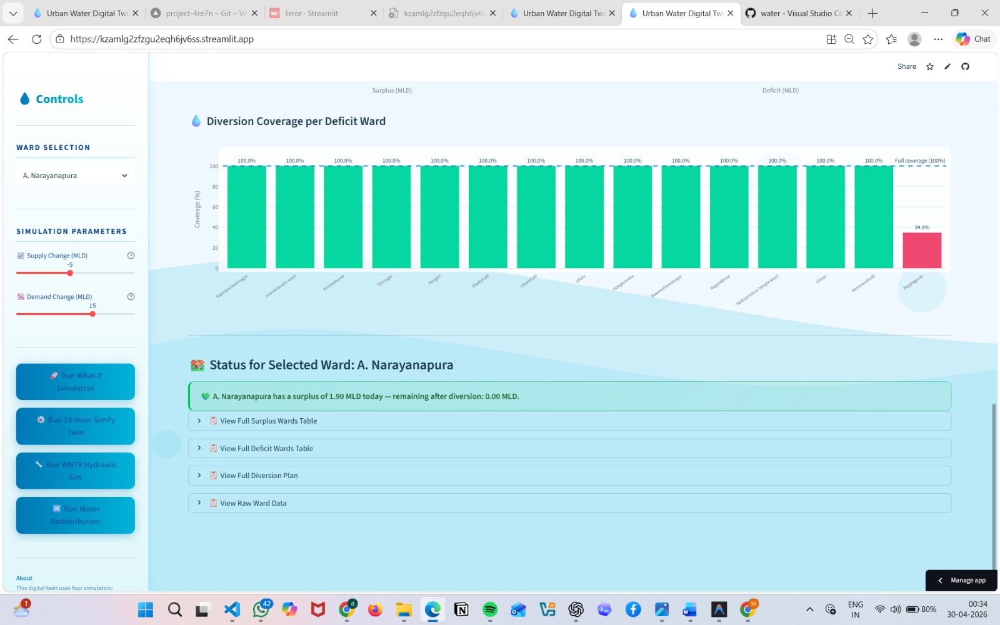

---

##  Installation

### Clone Repository

```bash
git clone https://github.com/avyshnavi45/urban-water-digital-twin.git
cd urban-water-digital-twin
```

### Install Dependencies

```bash
pip install -r requirements.txt
```

### Run Application

```bash
streamlit run app.py
```

---

##  Deployment

The application is deployed using Streamlit Community Cloud.

### Live Application

https://kzamlg2zfzgu2eqh6jv6ss.streamlit.app

### Deployment Features

* Automated GitHub integration
* Automatic redeployment after every push
* Public cloud hosting
* Zero infrastructure management

---

##  Author

### A. Vyshnavi

GitHub:
https://github.com/avyshnavi45

LinkedIn:
https://www.linkedin.com/in/vyshnavi-vyshnavi-359882360/

---

##  License

This project is licensed under the MIT License.
